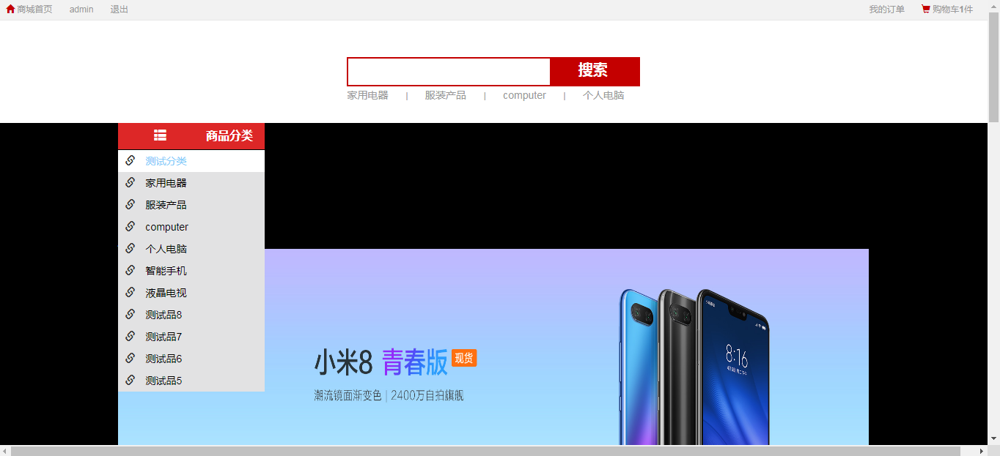
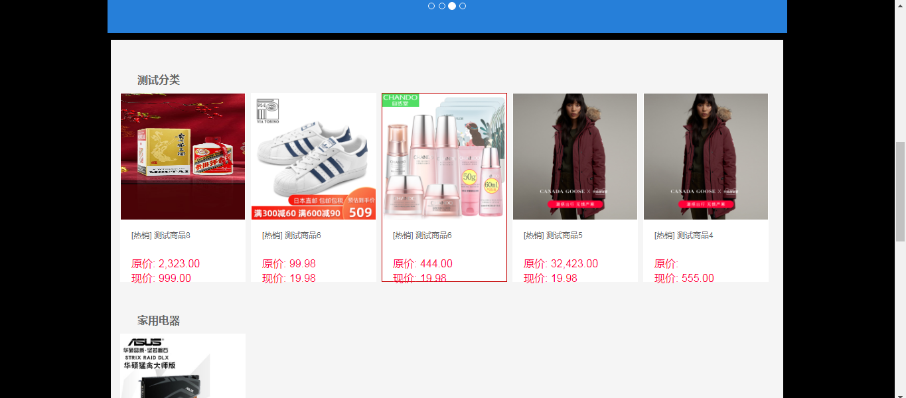
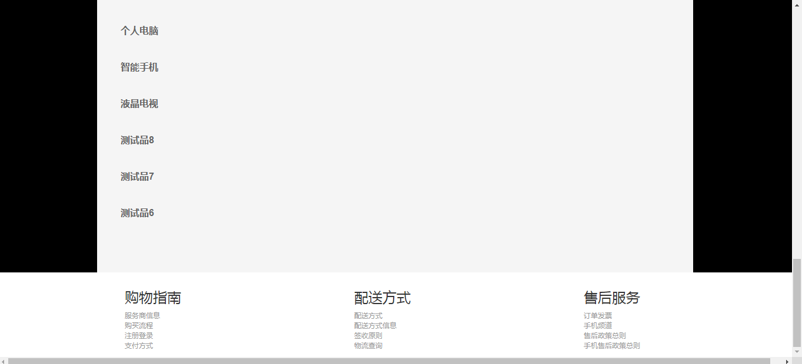
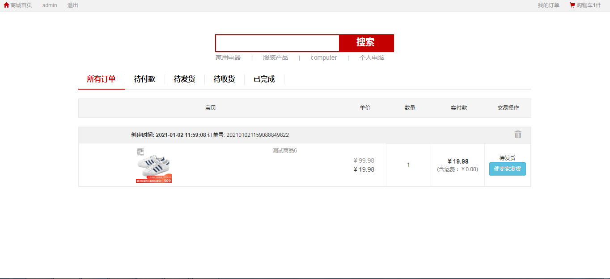
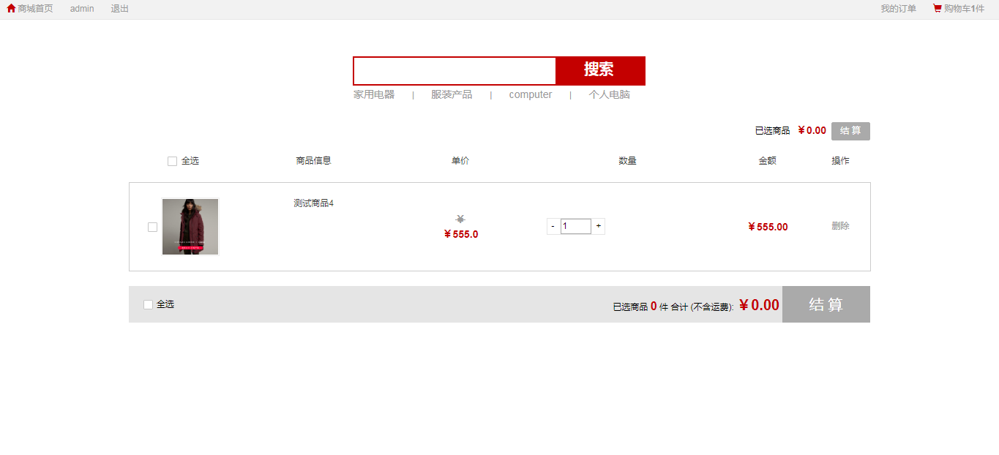
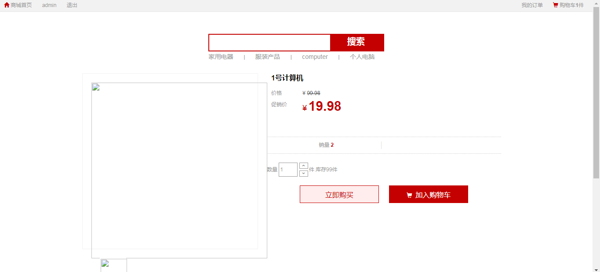
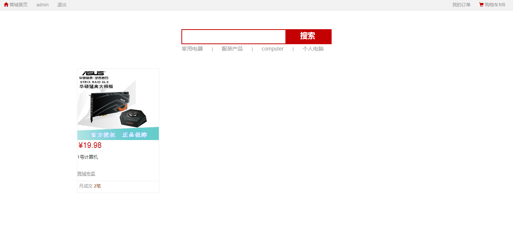
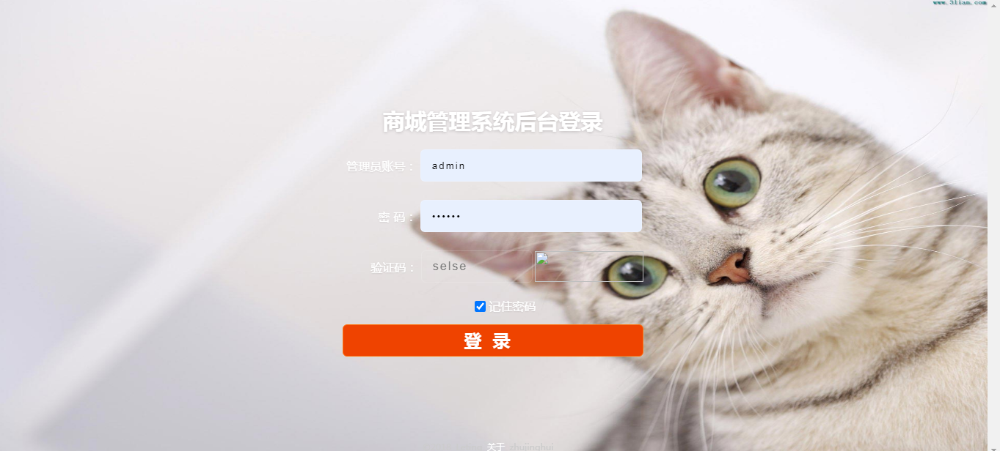
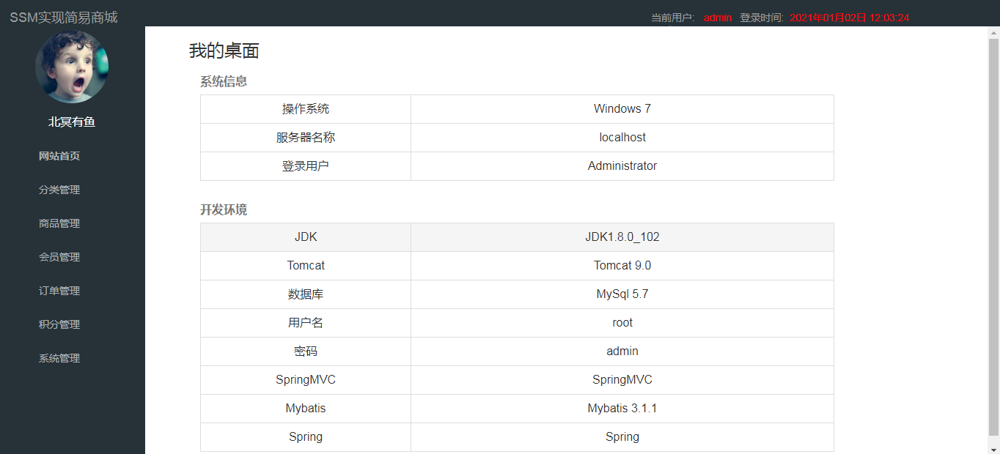

<h1 align="center">电子商务商城管理系统</h1>

## 简介
电子商务商城管理系统：功能包括购物车管理、订单管理、商品分类浏览、商品详情查看及搜索功能，支持用户注册登录和管理员身份验证，界面简洁，操作便捷。    --计算机毕业设计源码；毕设源码；java毕业设计源码

## 联系方式

<h3 align="center">获取完整代码与数据库文件 + 微信：deepguan QQ: 86050149 QQ群: 783742310</h3>

<h3 align="center">可帮忙远程部署 包运行成功！提供远程部署、修改代码、设计文档指导、代码讲解等服务！</h3>

## 功能介绍（完整见运行截图）
管理员：基本功能包括登录、注册和退出，支持查看网站首页的主导航栏和彩色商品推荐区域。商品管理功能涵盖商品列表展示、商品搜索、商品详情查看、购物车管理和结算功能。系统还提供订单管理模块和详细信息查看功能，并支持订单状态管理和操作选项，如催发货和删除订单。此外，管理员可以访问店铺展示部分和各种售后服务选项。

用户：涵盖基本功能如登录、注册和退出，同时可以通过网站首页的导航栏和商品类目进行浏览。用户可以在商品列表中选择商品，并查看详细信息，如品牌、型号、价格等。同时，用户可以管理购物车内的商品，包括数量修改和删除操作，并查看商品合计价格。此外，用户访问个人中心以管理个人信息、查询订单、保存地址和收藏商品，以及跟进订单处理和售后政策。

## 运行截图

本代码来源于网络,仅供学习参考使用!

